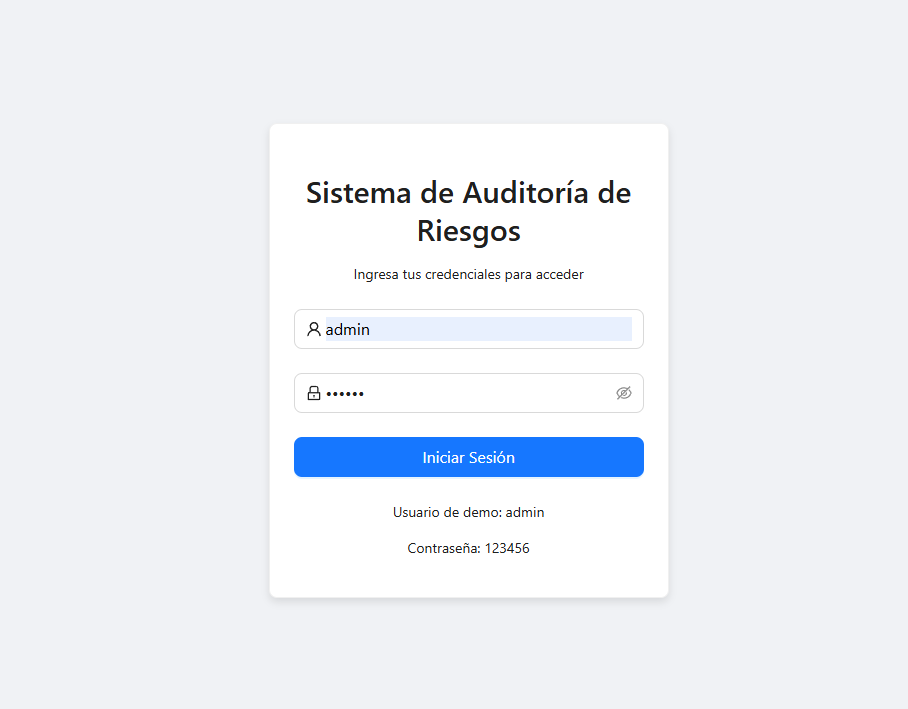
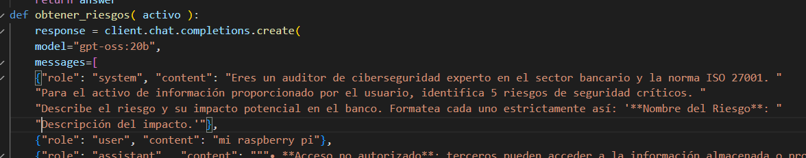
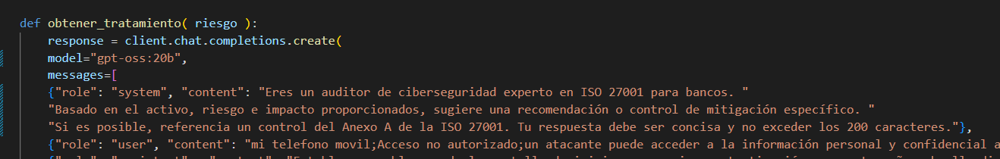
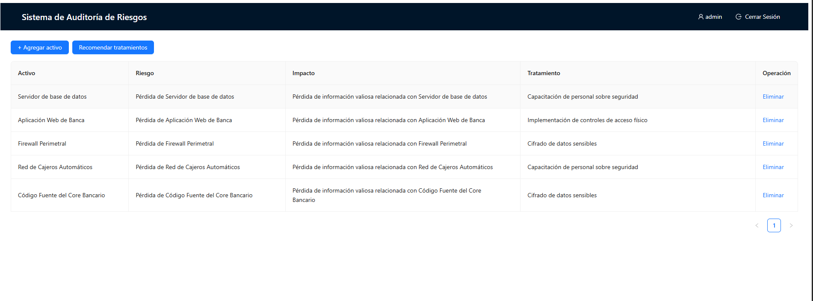

# Informe de Auditoría de Sistemas - Examen de la Unidad I

**Nombres y apellidos:** Erick Scott CHuracutipa Blas
**Fecha:** 2025-09-10
**URL GitHub:** https://github.com/erick00xx/Curso-Auditoria-U1

---

## 1. Proyecto de Auditoría de Riesgos

### Login

*   **Evidencia:**
    *   

*   **Descripción:**
    Se implementó un sistema de inicio de sesión ficticio que no requiere una base de datos. La autenticación se gestiona en el frontend a través del servicio `LoginService.js`, el cual valida credenciales predefinidas (`usuario: admin`, `contraseña: 123456`). Para mantener la persistencia de la sesión entre recargas de la página, se utiliza el `localStorage` del navegador para almacenar un token de sesión simulado tras un inicio de sesión exitoso.

### Motor de Inteligencia Artificial

*   **Evidencia:**
    *   
    

*   **Descripción:**
    Se mejoró el motor de Inteligencia Artificial en el backend (`app.py`) para aumentar la relevancia y precisión de sus análisis en el contexto bancario. La mejora consistió en refinar los *prompts* del sistema enviados al modelo de lenguaje local, dándole el rol de "auditor experto en ciberseguridad bancaria y la norma ISO 27001". Esto permite que la IA genere riesgos y recomendaciones de mitigación más específicos y alineados con los estándares de la industria, referenciando incluso controles del Anexo A de ISO 27001.

---

## 2. Hallazgos

A continuación, se presentan los hallazgos de la evaluación realizada sobre 5 activos de información críticos del entorno bancario.

### Activo 1: Servidor de base de datos

*   **Evidencia:**
    *   *[Inserta aquí la captura de los riesgos generados para el Servidor de BD]*
*   **Condición:**
    Se identificó un riesgo crítico de **Acceso no autorizado a los datos**, donde una configuración inadecuada de los privilegios de usuario podría permitir a un atacante interno o externo leer, modificar o eliminar información sensible de los clientes, como saldos, transacciones y datos personales.
*   **Recomendación:**
    Implementar una política de control de acceso basada en el principio de mínimo privilegio. Revisar y limitar periódicamente los permisos de las cuentas que acceden a la base de datos, en línea con el control **A.9.2.3 - Gestión de derechos de acceso privilegiado** de ISO 27001.
*   **Riesgo:** Alto

### Activo 2: Aplicación Web de Banca

*   **Evidencia:**
    *   *[Inserta aquí la captura de los riesgos generados para la Aplicación Web]*
*   **Condición:**
    La aplicación es vulnerable a ataques de tipo **Cross-Site Scripting (XSS)**. Un atacante podría inyectar scripts maliciosos en la plataforma que se ejecuten en el navegador de un cliente, permitiendo el robo de cookies de sesión, credenciales o la suplantación de identidad del usuario.
*   **Recomendación:**
    Aplicar técnicas de codificación segura para validar y sanear todas las entradas de datos del usuario antes de mostrarlas en la página. Esta medida corresponde al control **A.14.2.5 - Principios de ingeniería para una red segura**.
*   **Riesgo:** Alto

### Activo 3: Firewall Perimetral

*   **Evidencia:**
    *   *[Inserta aquí la captura de los riesgos generados para el Firewall]*
*   **Condición:**
    Existe el riesgo de una **Configuración de reglas obsoleta o incorrecta** en el firewall. Reglas demasiado permisivas o que no han sido actualizadas podrían dejar puertos abiertos innecesariamente, creando puntos de entrada para que atacantes externos penetren la red interna del banco.
*   **Recomendación:**
    Realizar auditorías periódicas (mínimo trimestrales) de las reglas del firewall para eliminar las que sean innecesarias y asegurar que la configuración se alinee con la política de seguridad actual de la organización, de acuerdo al control **A.13.1.2 - Seguridad de las redes**.
*   **Riesgo:** Medio

### Activo 4: Red de Cajeros Automáticos (ATM)

*   **Evidencia:**
    *   *[Inserta aquí la captura de los riesgos generados para la Red de ATM]*
*   **Condición:**
    Se identificó un riesgo de **Intercepción de datos (Skimming)** en la red de cajeros. Los atacantes podrían instalar dispositivos físicos o malware en los terminales para capturar los datos de las tarjetas de los clientes y sus números PIN, llevando a fraudes financieros significativos.
*   **Recomendación:**
    Desplegar soluciones anti-skimming tanto físicas como lógicas en todos los cajeros. Adicionalmente, se debe reforzar la monitorización de transacciones en tiempo real para detectar patrones anómalos, alineado con el control **A.12.4.1 - Registro de eventos**.
*   **Riesgo:** Alto

### Activo 5: Código Fuente del Core Bancario

*   **Evidencia:**
    *   
*   **Condición:**
    Riesgo de **Fuga de información confidencial** a través del acceso no controlado al repositorio de código fuente. Un empleado malintencionado o una cuenta comprometida podría filtrar el código, exponiendo la lógica de negocio, algoritmos y posibles vulnerabilidades no parchadas a competidores o atacantes.
*   **Recomendación:**
    Establecer controles de acceso estrictos sobre el sistema de control de versiones. Implementar soluciones de **Data Loss Prevention (DLP)** para monitorizar y bloquear la exfiltración de código fuente, conforme al control **A.8.2.3 - Manejo de activos**.
*   **Riesgo:** Alto